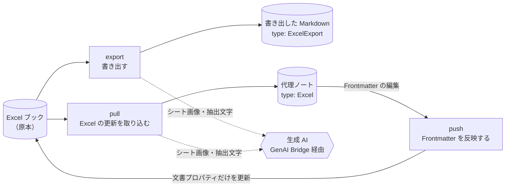
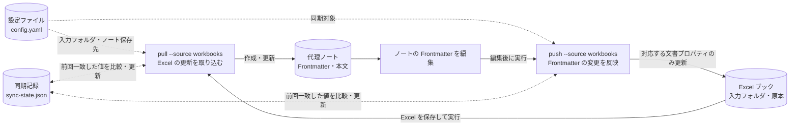

# Tkn Excel Note — Excel ブックを Markdown ノートにする CLI

`tkn-excel-note` は、Excel ブック（`.xlsx` / `.xlsm`）を、Frontmatter 付きの Markdown に変換するコマンドラインツールです。
セルの値や数式に加えて、図形・矢印・テキストボックスで描いたシートも、生成 AI で画像として読み取り、文章で説明できます。
Obsidian などのノート、全文検索、RAG（検索結果を生成 AI の入力に使う仕組み）から Excel の内容を参照しやすくすることが目的です。

初めて使う場合は、「[これは何か](#1-これは何か)」から「[1つのブックを Markdown にする](#3-1つのブックを-markdown-にする)」までを順に読んでください。
フォルダを継続的に同期する場合は、続けて「[フォルダを継続的に同期する](#4-フォルダを継続的に同期する)」を読みます。
「[コマンド一覧](#5-コマンド一覧)」以降は、必要になったときに参照する内容です。

## 1. これは何か

### 1.1. 得られる結果の例

次は、手順書をシート上の図形で描いたブックを、AI の説明付きで書き出した例です。
内容は架空の説明例で、Frontmatter と本文の一部を省略しています。

```shell
tkn-excel-note export "C:\path\to\移行手順.xlsx" --context
```

同じフォルダに `移行手順.xlsx.md` が作成されます。

```markdown
---
type: ExcelExport
title: 移行手順
author: Example User
sourceFileName: 移行手順.xlsx
generatedAt: '2026-10-01T03:00:00.000000+00:00'
generationMethod: context
contextStatus: current
---

# 移行手順

## Workbook Map

| Sheet | ID | State | Stored range | Content range | Populated cells | Tables | Shapes | ...
| --- | --- | --- | --- | --- | ---: | ---: | ---: | ...
| 手順 | 1 | visible | A1:H40 | B2:G38 | 52 | 0 | 14 | ...

## ブック要約

旧ファイルサーバーから新ストレージへ移行する手順と、切り戻しの判断基準をまとめたブックです。
「手順」シートの作業順序と、「判定表」シートの判断基準で構成されています。

## シート

### 手順

#### シート要約

移行作業を、事前準備・データ複製・切り替え・確認の4段階に分けたフロー図です。
複製の検証に失敗した場合は、切り替えに進まず事前準備へ戻る矢印が描かれています。

#### Extracted Text

- B2: 移行手順
- 正方形/長方形 3: データ複製（差分同期を2回実施）

```

`--context` を付けない場合は、AI を使わずに各シート内の「Extracted Text」（セル位置付きの値・数式・図形の文字）と「Workbook Map」（シートごとの範囲や図形数の表）だけを書き出します。

### 1.2. 2つの使い方

用途に応じて、次の2つの方法を使い分けます。

| 使い方 | コマンド | 向いている用途 | 出力 |
| --- | --- | --- | --- |
| 書き出し | `export` | 1つのブックやフォルダを、その場で Markdown にする | 各ブックの隣の `<ファイル名>.md`（`type: ExcelExport`） |
| 同期 | `pull` / `push` | 決まったフォルダのブックを、ノートとして継続的に管理する | ノート用フォルダの代理ノート（`type: Excel`） |

書き出しは、実行のたびに新しい Markdown を作ります。
前回の結果を再利用しないため、`--context` を付けると毎回 AI を呼び出します。

同期では、Excel の更新をノートへ取り込み（`pull`）、ノートの Frontmatter の編集を Excel の文書プロパティへ反映します（`push`）。
変更のないシートの AI 説明は再利用します。
どちらの方向でも、Excel が原本です。
セルや図形の内容を Markdown から Excel へ書き戻すことはできません。

### 1.3. 用語

| 用語 | 意味 |
| --- | --- |
| 代理ノート | 同期で作成・更新する Markdown ノートです。1つのブックに1つのノートが対応します。 |
| source | 入力フォルダと代理ノートの保存先を組にした同期対象です。設定ファイルの `sources.<id>` に定義し、`--source <id>` で選びます。 |
| 同期記録 | ブックとノートの対応と、前回両者が一致した値を保存したファイル（`sync-state.json`）です。変更の方向を判定するために使います。 |
| context | AI が生成するシートごとの説明（シート説明）と、ブック全体の説明（ブック要約）です。`--context` を指定したときだけ生成します。 |
| generator | AI の接続先・文章の profile・補足文の組に名前を付けた設定です。`--generator <id>` で切り替えます。 |

「profile」という語は、選ぶ対象の異なる3つの設定で使われています。

| 種類 | 設定する場所 | 選ぶもの | その実行だけ変える方法 |
| --- | --- | --- | --- |
| 文章の profile | `generation.prompt_profile`、または generator の `prompt_profile` | context の構成と言語（既定 `default-ja`、英語は `default-en`） | `--profile <名前>` |
| Bridge の profile | `generation.bridge_profile`、または generator の `bridge_profile` | AI の接続先・モデル・認証（GenAI Bridge の共有設定に定義） | `--generator <id>` で別の generator を選ぶ |
| ノートの profile | `sources.<id>.notes.profile` | 代理ノートのテンプレート（既定 `tkn-obsidian-v1`） | なし |

### 1.4. 全体像

長方形は処理、円筒形はデータ、六角形は外部の AI サービスを表します。
破線は、`--context` を指定したときだけ使う経路です。



AI の呼び出しは、画像対応モデルへの接続を共通化するライブラリ [GenAI Bridge](https://github.com/tuckn/tkn_genai_bridge)（`tkn_genai_bridge`）を通して行います。
接続先・モデル・認証は、このツールではなく GenAI Bridge の設定で管理します。

## 2. セットアップ

### 2.1. 前提

使う機能によって、必要な環境が異なります。

| 使う機能 | 必要なもの |
| --- | --- |
| AI を使わない書き出し・同期 | Python 3.11 以降、[uv](https://docs.astral.sh/uv/) |
| `--context`（AI による説明の生成） | 上記に加えて、Windows、デスクトップ版 Microsoft Excel、GenAI Bridge で設定した画像対応の AI 接続先 |
| `--cover sheet`（シート画像のカバー） | 上記の Python・uv に加えて、Windows、デスクトップ版 Microsoft Excel |

`--context` と `--cover sheet` 以外の処理は、ブックのファイルを直接読み取るため、Excel を起動しません。
動作確認は Windows で行っています。
Windows 以外での動作は未検証です。

### 2.2. インストール

ターミナルでリポジトリのフォルダへ移動し、CLI をインストールします。
依存ライブラリの GenAI Bridge は、インストール時に GitHub から取得します。

```shell
cd "C:\path\to\tkn_excel_note"
uv tool install .
tkn-excel-note --version
```

`tkn-excel-note 3.1.0` のようにバージョンが表示されれば、インストールは完了です。
コマンドとオプションの一覧は `tkn-excel-note --help`、各コマンドの詳細は `tkn-excel-note export --help` のように確認できます。

### 2.3. AI 接続を準備する（`--context` を使う場合）

AI を使わない場合、この手順は不要です。

`--context` は、GenAI Bridge の共有設定 `~/.tkn/genai_bridge/config.yaml` に定義した接続先を使います。
既定の接続先 `codex-default` は、ログイン済みの Codex CLI を使います。
ほかの接続先と共有設定の作成方法は、[GenAI Bridge のセットアップ](https://github.com/tuckn/tkn_genai_bridge#セットアップ)を参照してください。
接続先には、画像入力に対応するモデルを指定します。

接続先の切り替え方法と、このツール側の設定は「[AI によるシート説明とブック要約](docs/guides/sheet-content.md#準備)」で説明しています。

## 3. 1つのブックを Markdown にする

`export` は、設定ファイルを用意せずに使えます。
Excel で編集中のブックは、先に保存してから実行します。
保存されていない編集は読み取りません。

### 3.1. 最初の書き出し

まず AI を使わずに書き出し、出力を確認します。

```shell
tkn-excel-note export "C:\path\to\book.xlsx"
```

ブックと同じフォルダに `book.xlsx.md` が作成されます。
出力のファイル名は、拡張子を含む元のファイル名に `.md` を付けたものです。

完了すると、標準出力に1行の結果 JSON が表示されます。
`"status":"success"` と `"exported":1` であれば、書き出しは成功しています。
作成した Markdown には、次の内容が入ります。

- Frontmatter：タイトル・作成者などの文書プロパティ、元ファイルのパス、元ファイルの内容のハッシュ値（`sourceSnapshotSha256`）、生成日時。
- Workbook Map：シートごとの使用範囲、値のあるセル数、テーブル・図形・画像・グラフの数。
- Extracted Text：セル位置付きの保存値、数式、読み取れる図形の文字。数式は再計算しません。

出力先を指定する場合は `--output` を使います。

```shell
tkn-excel-note export "C:\path\to\book.xlsx" --output "C:\path\to\notes\book.md"
```

### 3.2. AI による説明を付ける

`--context` を付けると、シートを画像化して AI で解析し、シート説明とブック要約を Markdown に追加します。
図形や矢印で描いたフロー図など、セルの値だけでは意味が分からないシートで役立ちます。

> [!IMPORTANT]
> `--context` は、選択したシートの画像・抽出した文字・配置の情報を、設定した AI 接続先へ送信します。
> `export` では、実行のたびに「選択したシート数 + 1」回（シートごとに1回とブック要約に1回）AI を呼び出し、接続先によっては費用や利用枠を消費します。
> 送信先と費用の扱いを確認してから実行してください。

最初は `--dry-run` で、入力・設定・出力先を検証します。
`--dry-run` は Excel の起動、AI の呼び出し、ファイルの保存を行いません。

```shell
tkn-excel-note export "C:\path\to\book.xlsx" --context --dry-run
tkn-excel-note export "C:\path\to\book.xlsx" --context
```

画像化には、デスクトップ版 Excel を裏で起動します。
ブックの一時コピーを開いて描画するため、元のブックや作業中の Excel は変更しません。
画像と抽出の根拠データは、Markdown と同じフォルダの `img/` に保存されます。
Markdown を移動・共有するときは、`img/` も一緒に扱ってください。

既定では、表示中のすべてのワークシートを解析します。
1シートの画像が24枚、またはセル・オブジェクトがそれぞれ10,000件を超える場合は、対象を切り詰めずにエラーとして停止します。
上限は設定で変更できます（「[設定リファレンス](docs/reference/configuration.md#ai-生成の設定)」）。

生成した説明には AI の解釈が含まれます。
小さな文字や矢印の接続先は誤読される場合があるため、重要な箇所は元のシートと見比べてください。

### 3.3. 対象シートと出力言語を選ぶ

`--sheet` で解析するシートを名前で指定できます。
繰り返し指定でき、非表示のシートも名前を指定すれば解析します。
シート名は `workbook list-sheets` で確認できます。

```shell
tkn-excel-note workbook list-sheets --workbook "C:\path\to\book.xlsx"
tkn-excel-note export "C:\path\to\book.xlsx" --context --sheet "手順" --sheet "判定表"
```

`--profile` で、説明の構成と言語を選びます。
既定は日本語の `default-ja` で、英語にする場合は `default-en` を指定します。

```shell
tkn-excel-note export "C:\path\to\book.xlsx" --context --profile default-en
```

### 3.4. 補足文を添える

ブックの背景や社内用語など、シートから読み取れない情報を補足文として AI に渡せます。
`--reference` で文章を直接、`--reference-file` で UTF-8 のファイルを指定します。
どちらも繰り返し指定でき、併用もできます。

```shell
tkn-excel-note export "C:\path\to\book.xlsx" --context --reference "移行方式の比較検討メモです。" --reference-file "C:\path\to\background.md"
```

AI には、Excel の記載を優先し、補足文だけにある事実をブックの記載として書かないよう指示します。
補足文は、シート説明とブック要約の両方に渡します。
よく使う補足文は、設定ファイルの generator に保存できます（「[名前付き generator と補足文](docs/reference/configuration.md#名前付き-generator-と補足文)」）。

### 3.5. フォルダをまとめて書き出す

フォルダを指定すると、サブフォルダを含むすべての `.xlsx` / `.xlsm` を書き出します。
各ブックの隣に `<ファイル名>.md` を作成します。
Excel の一時ファイル（`~$` で始まるファイル）は対象外です。

```shell
tkn-excel-note export "C:\path\to\workbooks" --dry-run
tkn-excel-note export "C:\path\to\workbooks"
```

フォルダを指定した場合、`--output` は使えません。
一部のブックで失敗しても、ほかのブックの出力は保存し、失敗したブックを結果 JSON の `results` に `export-error` として報告します。

### 3.6. 書き出し直す

既存の Markdown は、既定では上書きしません。
同じ出力先に書き出し直す場合は `--force` を指定します。

```shell
tkn-excel-note export "C:\path\to\book.xlsx" --context --force
```

置き換えは、そのブックのすべての生成が成功した後に行います。
生成に失敗した場合や、処理中にブックか Markdown が変更された場合は、既存の Markdown を残します。
`--force` で置き換えても、以前の `img/` の画像は削除しません。

書き出した Markdown（`type: ExcelExport`）は、`push` で Excel へ反映する対象になりません。
Frontmatter の編集を Excel に反映したい場合は、次の同期を使います。

## 4. フォルダを継続的に同期する

同期では、設定ファイルに登録した source ごとに、ブックと代理ノートを対応付けて管理します。
`pull` と `push` は、実行したときに一度だけ処理します。
フォルダを常に監視する機能はないため、定期的に取り込む場合はタスクスケジューラーなどから `pull` を実行します。



### 4.1. 設定ファイルを作る

設定ファイルのひな形を作成します。

```shell
tkn-excel-note config init
```

`~/.tkn/excel_note/config.yaml` が作成され、そのパスが結果 JSON の `configPath` に表示されます。
内容の異なるファイルが既にある場合は、エラーになり置き換えません。

作成したファイルの `sources` を、自分の入力フォルダとノート保存先に書き換えます。
ひな形にはサンプルの source `personal-excel` があります。
次の例では、source の ID を `workbooks` に変えています。
`sources` 以外の項目はそのまま残します。

```yaml
sources:
  workbooks:
    workbooks_dir: 'C:\path\to\workbooks'
    recursive: true
    include: ['*.xlsx', '*.xlsm']
    notes:
      dir: 'C:\path\to\notes'
      frontmatter_term_format: plain
```

| 設定キー | 意味 |
| --- | --- |
| `workbooks_dir` | 入力ブックのフォルダです。 |
| `recursive` | `true` でサブフォルダも対象にし、フォルダ構成をノート側にも再現します。 |
| `include` | 対象にするファイルのパターンです。 |
| `notes.dir` | 代理ノートを保存するフォルダです。Obsidian の Vault 内のフォルダを指定できます。 |
| `notes.frontmatter_term_format` | `plain` で `keywords` と `categories` を通常の文字列に、既定の `obsidian-link` で `[[...]]` のリンクにします。 |

Windows のパスは、例のようにシングルクォートで囲みます。
編集後、読み込まれた設定を確認します。

```shell
tkn-excel-note config list
```

`config list` は `config.cover.mode=auto` のように1行ずつ表示します。Windows パスはそのままコピーできます。
JSON が必要な場合は `tkn-excel-note config list --json` を使います。

ほかの設定キーと、設定ファイルの優先順位は「[設定リファレンス](docs/reference/configuration.md)」を参照してください。

### 4.2. 最初の取り込み

`--dry-run` で、作成される代理ノートを確認してから実行します。

```shell
tkn-excel-note pull --source workbooks --dry-run
tkn-excel-note pull --source workbooks
```

`notes.dir` に、ブックごとの代理ノート `<ファイル名>.md` が作成されます。
`recursive: true` の場合、入力フォルダの `2026/example.xlsx` は `notes.dir` の `2026/example.xlsx.md` になります。
代理ノートの Frontmatter には、`noteId`（ノートの識別子）や `sourceFileName`（入力フォルダからの相対パス）など、同期に使う項目が入ります。
形式は `type: "excel"` / `schemaVersion: "3.0.0"` です。先頭の基本情報、Excel文書情報、元ファイル、AI生成情報、末尾の `tags`・`created`・`updated`・`noteId` の順に揃えます。日時は日本時間・秒単位・ダブルクォート付きです。旧 `date` は次のノート更新時に `created` へ引き継ぎます。YAMLだけを一括移行する方法は「[ノートの形式](docs/reference/note-format.md#既存代理ノートのyamlだけを移行する)」を参照してください。

結果は画面に表示され、処理ごとのレポートが `~/.tkn/excel_note/state/runs/<run-id>/` に保存されます。
作成されたノートは `created` と表示されます。
状態の意味は「[実行結果の読み方](#6-実行結果の読み方)」を参照してください。

AI の説明も生成する場合は、`--context` を付けます。
送信する情報と呼び出し回数は「[AI による説明を付ける](#32-ai-による説明を付ける)」と同じです。

```shell
tkn-excel-note pull --source workbooks --context --dry-run
tkn-excel-note pull --source workbooks --context
```

`pull` は `--source <id>` または `--all-sources` のどちらかを指定します。併用はできません。
source 内の1ブックだけを取り込む場合は、ファイル名を指定します。
相対パスは `workbooks_dir` が基準です。配下の絶対パスも使えます。
`recursive`・`include`・`ignore` の設定は引き続き適用します。ファイル指定は `--all-sources` と併用できません。

```shell
tkn-excel-note pull --source workbooks "example.xlsx" --dry-run
tkn-excel-note pull --source workbooks "example.xlsx" --sheet "概要" --context
```

登録済みのすべての source をまとめて取り込む場合は、次のように実行します。
`--context` や cover のオプションも組み合わせられます。

```shell
tkn-excel-note pull --all-sources --dry-run
tkn-excel-note pull --all-sources
tkn-excel-note pull --all-sources --context
```

### 4.3. Excel の更新を取り込む

Excel を保存した後、同じ `pull` を実行します。

```shell
tkn-excel-note pull --source workbooks --context
```

`--context` を付けた `pull` は、変更のないシートの説明を再利用し、変更されたシートだけを AI で解析し直します。
すべての説明を再利用できる場合、AI の呼び出しは0回です。
補足文の内容や文章の profile を変えた場合は、該当するシートとブック要約を生成し直します。

`--context` を付けずに `pull` を実行すると、既存の説明はそのまま残します。
説明の生成後に Excel の内容が変わっていれば、Frontmatter の `contextStatus` を `stale` にして、説明が古いことを示します。

| `contextStatus` | 意味 |
| --- | --- |
| `not-generated` | 説明をまだ生成していません。 |
| `current` | すべてのシートの説明が、保存済みの Excel と対応しています。人が内容を確認したという意味ではありません。 |
| `partial` | 説明を生成していないシートがあります。 |
| `stale` | 説明の生成後に Excel の内容が変わりました。`--context` を付けて `pull` すると更新します。 |
| `unverified` | 手直しされた説明などがあり、Excel との対応を確認できません。 |

代理ノートの本文のうち、ツールが管理する範囲は `<!-- excel-catalog:begin ... -->` と `<!-- excel-catalog:end ... -->` のマーカーで囲まれています。
マーカーの外に書いた文章と、ツールが知らない Frontmatter 項目は保持します。
マーカー内の説明を手直しした場合、`--context` はその説明を上書きせずに停止します。
意図して生成し直す場合だけ `--context --force` を指定します。

### 4.4. Frontmatter の変更を Excel に反映する

代理ノートの次の項目を編集すると、Excel の文書プロパティへ反映できます。

| 代理ノートの項目 | Excel の文書プロパティ |
| --- | --- |
| `title` | タイトル |
| `subject` | 件名 |
| `author` | 作成者 |
| `keywords` | キーワード |
| `categories` | 分類 |
| `comments` | コメント |

```shell
tkn-excel-note push --source workbooks --dry-run
tkn-excel-note push --source workbooks
```

特定のノートだけを反映する場合は、`--note "book.xlsx.md"` のようにノート名を指定します。

`push` は、ブックをバックアップしてから文書プロパティだけを書き換え、書き込み後に内容を検証します。
セル、図形、AI の説明、ノートの本文は Excel へ書き戻しません。
バックアップは `~/.tkn/excel_note/state/backups/` に保存されます。

Excel とノートで同じ項目を別々の値に変えていた場合、そのブックへの反映を見送り、`conflict` として報告します。
どちらの値を採用するかを指定して解決する方法は、「[競合の判定と解決](docs/reference/synchronization.md#競合の判定と解決)」を参照してください。

### 4.5. カード表示用の画像（cover）を作る

`pull` は、Frontmatter の `cover` に、ブックの画像へのリンクを設定します。
Obsidian Bases のカードビューで、この画像をサムネイルとして表示できます。

既定では、Excel が保存時に埋め込んだサムネイル画像を使います。
サムネイルがないブックや、特定の範囲を表示したい場合は、シートの指定範囲を画像化できます。
この画像化は Excel を使いますが、AI は使いません。

```shell
tkn-excel-note pull --source workbooks --cover sheet --cover-range "A1:Q50"
```

一度成功した条件はブックごとに記録され、次回からはオプションを省略しても同じ条件で更新します。
手動で設定した `cover` は上書きしません。
設定方法とカードビューの例は、「[代理ノートの管理](docs/guides/catalog-operations.md)」を参照してください。

### 4.6. 失敗した後に再実行する

一部のブックで失敗しても、ほかのブックの処理結果は残ります。
原因を解消した後、同じコマンドを再実行してください。
`pull --context` は、完了したシートの説明を再利用して、残りから続けます。

ブックを移動・名前変更した場合や、元のブックを削除した場合の扱いは、「[同期の仕様](docs/reference/synchronization.md#名前変更と移動)」と「[元ブックがない代理ノートを削除する](docs/guides/catalog-operations.md#元ブックがない代理ノートを削除する)」を参照してください。
通常の同期で、ブックや代理ノートを削除することはありません。

## 5. コマンド一覧

| 目的 | コマンド | 詳細 |
| --- | --- | --- |
| ブックまたはフォルダを Markdown に書き出す | `export <ファイルまたはフォルダ> [--context]` | [1つのブックを Markdown にする](#3-1つのブックを-markdown-にする) |
| 設定ファイルを作成・確認する | `config init` / `config list` | [設定リファレンス](docs/reference/configuration.md) |
| Excel の更新を代理ノートへ取り込む | `pull (--source <id> または --all-sources) [--context]` | [最初の取り込み](#42-最初の取り込み) |
| Frontmatter の編集を Excel へ反映する | `push --source <id> [--note <ノート>]` | [Frontmatter の変更を Excel に反映する](#44-frontmatter-の変更を-excel-に反映する) |
| 同期の状況を確認する（変更なし） | `status --source <id>` | [同期の仕様](docs/reference/synchronization.md#状態と次の操作) |
| 保存済みブックのシート名を一覧する | `workbook list-sheets --workbook <パス>` | [対象シートと出力言語を選ぶ](#33-対象シートと出力言語を選ぶ) |
| ブックに移動を追跡するための固定 ID を付ける | `adopt --source <id>` | [名前変更と移動](docs/reference/synchronization.md#名前変更と移動) |
| 元ブックがない代理ノートを削除する | `delete-notes --source <id> --note <ノート>` | [代理ノートの管理](docs/guides/catalog-operations.md#元ブックがない代理ノートを削除する) |

書き込みを伴うコマンド（`export`、`pull`、`push`、`adopt`、`delete-notes`）は、`--dry-run` で変更予定だけを確認できます。
次のオプションは、サブコマンドより前に指定します。

| オプション | 動作 |
| --- | --- |
| `--config <パス>` | 指定した設定ファイルを、ほかの設定ファイルより優先して読み込みます。 |
| `-v` / `--verbose` | 比較した値や変更予定の方向などの詳細を表示します。 |
| `-q` / `--quiet` | 情報ログを表示しません。 |
| `--no-color` | ログを色なしで表示します。 |
| `--report-dir <パス>` | 実行レポートの保存先を変更します。 |

## 6. 実行結果の読み方

処理の進捗は標準エラー出力に、処理結果は標準出力に1行の JSON で出力します。
`config list` は既定で1行ごとの `key=value` を表示し、`--json` で JSON に切り替えます。
スクリプトから利用する場合は、標準出力の JSON と終了コードで結果を判定できます。

| 終了コード | 意味 |
| --- | --- |
| `0` | 成功しました。`rename-required` などの確認が必要な状態が残る場合もあるため、結果 JSON の `statusCounts` も確認します。 |
| `1` | 一部またはすべての対象で、読み取り・生成・書き込みに失敗しました。 |
| `2` | 未解決の競合があります。コマンドの引数に誤りがある場合も `2` になります。 |
| `3` | 設定ファイルや対象の指定に誤りがあります。 |

`status` と、`--dry-run` を付けない同期コマンドは、実行レポートを `~/.tkn/excel_note/state/runs/<run-id>/` に保存します。
ファイルごとの結果は `actions.csv`、項目ごとの比較は `differences.csv` で確認できます。
`export` はレポートを保存しません。
状態の一覧と対応方法は「[状態と次の操作](docs/reference/synchronization.md#状態と次の操作)」を参照してください。

## 7. 保存場所

| 保存場所 | 内容 | 失った場合の影響 |
| --- | --- | --- |
| `~/.tkn/excel_note/config.yaml` | 設定ファイル | 入力フォルダと保存先の指定を作り直す必要があります。 |
| `notes.dir`（source ごと） | 代理ノートと、その `img/` の画像 | 手書きの本文と生成済みの説明を失います。ブックからは復元できません。 |
| `~/.tkn/excel_note/state/sync-state.json` | 同期記録 | 既存の差分が競合として扱われることがあります。 |
| `~/.tkn/excel_note/state/backups/` | `push` などで書き換える前のブック、削除前のノート | 過去の状態に戻せなくなります。 |
| `~/.tkn/excel_note/state/context/` | 説明の再利用・保護の記録と AI の使用量 | 説明を再利用できなくなります。手直しの有無を確認できないため、既存の説明の置き換えが止まる場合があります。 |
| `~/.tkn/excel_note/state/runs/` | 実行レポート | 過去の実行を調べられなくなります。 |
| `~/.tkn/excel_note/state/export/usage/` | `export --context` の AI 使用量 | 使用量の記録を失います。書き出し結果には影響しません。 |

別の PC へ移す場合は、ブック、代理ノートと画像、`~/.tkn/excel_note/` を一緒に移します。
ノートとレポートには、元ファイルのパスや抽出した本文が含まれます。
公開するリポジトリなどに含めないよう注意してください。

## 8. 対応範囲と制限

- 入力は `.xlsx` と `.xlsm` です。旧形式の `.xls` は、同梱のスクリプトで変換してから使います（「[旧 `.xls` を変換する](docs/guides/catalog-operations.md#旧-xls-を変換する)」）。
- 保存済みの内容だけを読み取ります。Excel で開いたまま保存していない編集は対象外です。
- 数式は再計算せず、保存されている値を使います。
- チャートシートなど、ワークシート以外のシートは内容を抽出せず、未対応として記録します。
- Excel へ書き戻せるのは、[Frontmatter の変更を Excel に反映する](#44-frontmatter-の変更を-excel-に反映する)で示した文書プロパティだけです。
- デジタル署名付きのブックへの書き込みは拒否します。
- AI の説明は解釈を含みます。`contextStatus: current` は、説明と Excel の対応を示すもので、内容の正確さを保証しません。

## 9. 更新

リポジトリを更新した後は、CLI を再インストールします。

```shell
cd "C:\path\to\tkn_excel_note"
uv tool install . --reinstall
tkn-excel-note --version
```

バージョンごとの変更内容は [CHANGELOG.md](CHANGELOG.md) を参照してください。

## 10. 開発と検証

開発用の依存関係をインストールし、テストと静的検査を実行します。

```shell
uv sync --locked
uv run pytest
uv run ruff check .
uv run mypy src
uv build
```

シート画像を使う機能の実機テストは、Windows とデスクトップ版 Excel がある環境で、環境変数を設定したときだけ実行されます。
テストは架空データのブックを作成し、非表示の専用 Excel インスタンスで描画します。

```powershell
$env:TKN_EXCEL_NOTE_NATIVE_TESTS = '1'
uv run pytest tests/test_sheet_cover_native.py
Remove-Item Env:TKN_EXCEL_NOTE_NATIVE_TESTS
```

コードの変更をインストール済みの CLI へすぐに反映する場合は、`uv tool install -e . --reinstall` で編集可能モードでインストールします。
依存関係、パッケージのメタデータ、同梱リソースを変更した場合は、再インストールが必要です。
テストと設定例には、架空のデータだけを使います。

Python パッケージ名は `excel_catalog_pipeline` です。
主な実装の入口は次のとおりです。

| ファイル | 担当 |
| --- | --- |
| [cli.py](src/excel_catalog_pipeline/cli.py) | コマンドと引数の定義 |
| [export.py](src/excel_catalog_pipeline/export.py) | `export` の書き出し |
| [pipeline.py](src/excel_catalog_pipeline/pipeline.py) | `pull` / `push` などの同期処理 |
| [ai_pull.py](src/excel_catalog_pipeline/ai_pull.py) | 同期と AI 生成の統合 |
| [context.py](src/excel_catalog_pipeline/context.py) | シートの画像化と説明の生成 |
| [note_profiles/](src/excel_catalog_pipeline/note_profiles/tkn-obsidian-v1/template.md) | 代理ノートのテンプレート |
| [context_profiles/](src/excel_catalog_pipeline/context_profiles/) | 文章の profile（プロンプト・出力スキーマ・テンプレート） |

## 11. 関連ドキュメント

| 文書 | 読む目的 |
| --- | --- |
| [AI によるシート説明とブック要約](docs/guides/sheet-content.md) | AI 接続の準備、説明の再利用と保護、独自の文章 profile の作成 |
| [代理ノートの管理](docs/guides/catalog-operations.md) | cover 画像の設定、元ブックがないノートの削除、`.xls` の変換 |
| [設定リファレンス](docs/reference/configuration.md) | すべての設定キー、既定値、設定ファイルの優先順位 |
| [同期の仕様](docs/reference/synchronization.md) | 項目の対応、競合の解決、名前変更、状態と終了コード、レポート |
| [ノートの形式](docs/reference/note-format.md) | Frontmatter の項目、本文の構成、Workbook Map の各列の意味 |
| [変更履歴](CHANGELOG.md) | バージョンごとの変更点 |
| [ライセンス](LICENSE) | 利用許諾 |
