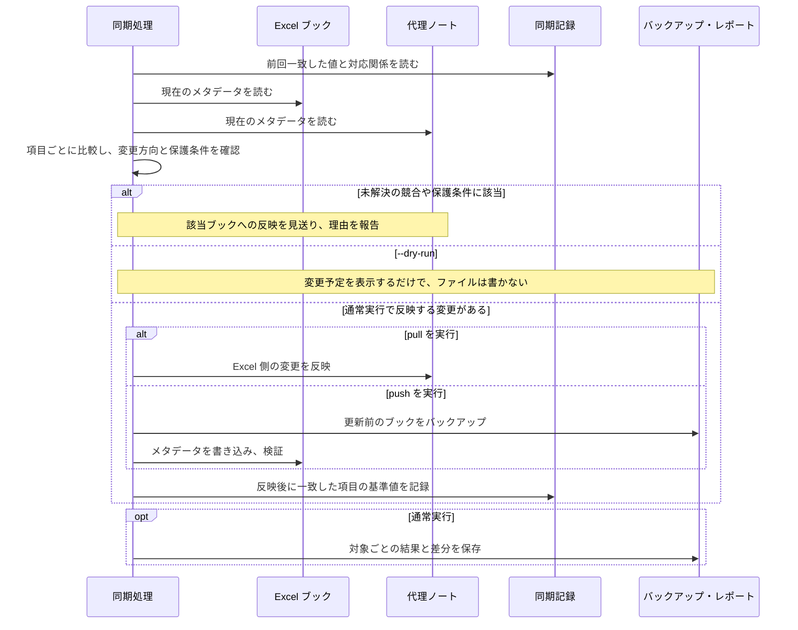

# 同期の仕様

`pull` と `push` による同期で、どの項目をどの方向に反映し、競合や名前変更をどう扱うかを定義します。
実行結果の状態、終了コード、レポートの読み方もこの文書にまとめます。
同期を始める手順は、[README の「フォルダを継続的に同期する」](../../README.md#4-フォルダを継続的に同期する)を参照してください。

同期の対象は、設定ファイルに登録した source の代理ノート（`type: excel`。旧 `Excel` も認識）です。
`export` で書き出した Markdown（`type: ExcelExport`）は対象外です。

## メタデータの対応

代理ノートの Frontmatter と、Excel の文書プロパティを次のように対応させます。

| 代理ノートの項目 | Excel の値 | 反映の方向 |
| --- | --- | --- |
| `title` | タイトル（Title） | 双方向 |
| `subject` | 件名（Subject） | 双方向 |
| `author` | 作成者（Author / creator）。1つの文字列です。 | 双方向 |
| `keywords` | キーワード（Keywords） | 双方向 |
| `categories` | 分類（Category） | 双方向 |
| `comments` | コメント（Comments / description） | 双方向 |
| `sourceCreated` / `sourceModified` | 作成日時・更新日時 | Excel からノートのみ |
| `sourceFileName` | 入力フォルダからの相対パス | 編集すると名前変更・移動の要求になります。 |

`keywords` と `categories` は一覧として扱います。
Excel へ反映するときは、Obsidian のリンク記法 `[[...]]` を外し、`; ` で区切った1つの文字列にします。
カンマは区切り文字ではなく、語の一部として扱います。

`description`、AI の説明、本文は Excel へ反映しません。
Frontmatter のその他の項目は「[ノートの形式](note-format.md#代理ノートの-frontmatter)」を参照してください。

## 比較から反映までの流れ

既存のブックと代理ノートを同期するときの処理を示します。
矢印は読み取り・書き込みの要求、枠は条件による分岐です。
実行したコマンドの方向に反映できる変更だけを適用します。



初回の `pull` では、代理ノートと同期記録を新しく作成します。
図では、名前変更の処理と、書き込みに失敗したときの復元を省略しています。
それぞれ「[名前変更と移動](#名前変更と移動)」と「[Excel への書き込みを保護する仕組み](#excel-への書き込みを保護する仕組み)」を参照してください。
競合や失敗があっても、ほかのブックで成功した変更は残ります。

## 競合の判定と解決

変更の方向は、更新日時ではなく、同期記録（`sync-state.json`）に保存した「前回 Excel とノートが一致した値」との比較で判定します。
前回のタイトルが「製品比較」だった場合の例を示します。

| Excel の値 | ノートの値 | 判定 |
| --- | --- | --- |
| 製品比較 2026 | 製品比較 | Excel だけが変わったため、`pull` で反映します。 |
| 製品比較 | 製品比較 2026 | ノートだけが変わったため、`push` で反映します。 |
| 製品比較 2026 | 製品比較（改訂） | 両方が別の値に変わったため、競合として報告します。 |

同期記録がなく、Excel とノートの値が異なる場合も競合になります。
反映後は、実際に一致した項目だけを基準値として記録します。
反対方向の未反映の変更は、次の実行に持ち越します。

競合の内容は、`-v` を付けた実行の表示か、レポートの `differences.csv` で確認します。
どちらの値を採用するかを決めたら、次のオプションで解決します。

| 採用する値 | コマンド |
| --- | --- |
| Excel の値 | `pull --source <id> --prefer-source` |
| ノートの値 | `push --source <id> --prefer-note` |

> [!WARNING]
> `pull --prefer-source` は、ノートだけで編集した項目も Excel の値で置き換えます。
> `--dry-run` で対象と差分を確認してから実行してください。

```shell
tkn-excel-note -v pull --source workbooks --prefer-source --dry-run
tkn-excel-note pull --source workbooks --prefer-source
```

`--prefer-source` を付けない通常の `pull` は、ノートだけで編集した項目を保持します。
`--prefer-source` と `--prefer-note` は同時に指定できません。

## 名前変更と移動

### ブックに固定 ID を付ける

`adopt` は、固定 ID（カスタムプロパティ `TknExcelCatalogId`）がないブックに ID を付けます。
ID があると、ブックを移動・名前変更しても同じブックとして追跡しやすくなります。
同期を始めるために必須の手順ではありません。
`adopt` はブックをバックアップしてから書き換えます。

```shell
tkn-excel-note adopt --source workbooks --dry-run
tkn-excel-note adopt --source workbooks
```

### パスを変更する

名前変更・移動には、次の2つの方向があります。

| 先に変更する場所 | ツールが変更するもの | 必要な設定と実行 |
| --- | --- | --- |
| エクスプローラーなどでブックを移動する | 代理ノートを、ブックの相対パスに合わせて移動する | `rename_adapter: filesystem` と通常の `pull` |
| ノートの `sourceFileName` を編集する | ブックと代理ノートを移動する | `rename_adapter: filesystem` と `push --allow-rename` |

既定の `rename_adapter: report-only` では、ファイルを移動せず、必要な移動を `rename-required` として報告します。
`filesystem` を設定しただけでは移動せず、上記のコマンドを `--dry-run` なしで実行したときに移動します。
`push --dry-run` でも `--allow-rename` を付けると、移動先を通常の実行と同じ条件で検証できます。

移動先は、入力フォルダ内の有効な相対パスで、拡張子が同じで、既存のファイルと重ならない必要があります。
`filesystem` は Obsidian のバックリンクを更新しません。
バックリンクを維持したい場合は、`report-only` のまま報告を確認し、Obsidian 上で移動してください。

移動の情報は画面に表示し、通常の実行では `actions.csv` と `details.json` にも記録します。
`pull` での移動先と衝突の情報は `details.json` で確認します。

## Excel への書き込みを保護する仕組み

`push` と `adopt` は、次の方法で Excel ブックを書き換えます。

- 書き換える前に、ブックを `~/.tkn/excel_note/state/backups/` にバックアップします。
- ブックのファイル（ZIP 形式）のうち、文書プロパティの部分だけを書き換えます。VBA を含むほかの部分は変更しません。
- 書き換えの前後で、ファイルの整合性とプロパティの値を読み直して検証します。
- 別のファイルで置き換えるのではなく、元のファイルに上書きするため、ファイルの作成日時などは変わりません。
- 上書きや検証に失敗した場合は、バックアップから内容と日時の復元を試みます。
- デジタル署名付きのブックや、ロックされていて安全に上書きできないブックへの書き込みは、失敗として扱います。

## 実行結果の読み方

### 画面表示と標準出力

処理の進捗と集計は、標準エラー出力に `[LEVEL] message` の形式で表示します。
`pull` は、変更があったノートの絶対パス（`notePath`）と、ブックの相対パス（`sourcePath`）を表示します。
`push` は、最初に入力フォルダとノートの設定を表示し、ノート名とブックの相対パスで結果を表示します。
変更のなかった対象（`unchanged`）は個別に表示せず、最後の集計に件数だけを出します。

標準出力には、コマンドの結果を JSON で出力します。`config list` の既定出力は1行ごとの `key=value` です。

| コマンド | 標準出力 | 保存するもの |
| --- | --- | --- |
| `status`、`--dry-run` なしの `pull` / `push` / `adopt` / `delete-notes` | 1行の JSON | 実行レポート |
| `--dry-run` 付きの各コマンド | 1行の JSON | なし |
| `export` | 1行の JSON | なし（AI の使用量の記録を除く） |
| `config init` / `workbook list-sheets` | 1行の JSON | `config init` は設定ファイル。`workbook list-sheets` は読み取りのみ |
| `config list` | 1行ごとの `key=value`（`--json` で1行の JSON） | なし |

`pull --context` の結果 JSON には、その実行の AI の使用量（`usage`）が含まれます。
シートごとの生成・再利用の結果は、レポートの `details.json` に記録します。

次のオプションで表示を変えられます。
いずれもサブコマンドの前に指定します。

| オプション | 動作 |
| --- | --- |
| `-v` / `--verbose` | Excel の値、ノートの値、基準値、反映予定の方向を表示します。 |
| `-q` / `--quiet` | 情報ログを表示しません。 |
| `--no-color` | 色を付けずに表示します。環境変数 `NO_COLOR` を設定しても同じです。 |

### 状態と次の操作

| 状態 | 意味 | 次の操作 |
| --- | --- | --- |
| `unchanged` | 同期する差分がありません。 | なし |
| `would-create` / `would-update` | `pull --dry-run` で、ノートを作成・更新する予定です。 | 内容を確認し、`--dry-run` なしで実行します。 |
| `created` / `updated` | ノートを作成・更新しました。 | なし |
| `would-write` / `written` | Excel へ書き込む予定です／書き込みと検証が完了しました。 | なし |
| `would-adopt` / `adopted` | 固定 ID を付ける予定です／付けました。 | なし |
| `missing-source` | 元のブックが見つからないか、ブックを1つに特定できません。 | ブックを削除した場合は、[`delete-notes`](../guides/catalog-operations.md#元ブックがない代理ノートを削除する)でノートを整理します。 |
| `missing-note` | 追跡しているノートがありません。 | `pull --dry-run` で作成予定を確認します。 |
| `pull-required` / `push-required` | 反対方向の未反映の変更があります。 | 該当する方向のコマンドを `--dry-run` で確認します。 |
| `conflict` | 両側で変更されたか、基準値がありません。 | 「[競合の判定と解決](#競合の判定と解決)」に従って解決します。 |
| `duplicate-id` | 複数のブックに同じ固定 ID があります。 | ブックをコピーして作った場合などに起きます。対応関係を確認します。 |
| `rename-required` | 名前変更・移動が必要ですが、設定または許可がありません。 | 「[パスを変更する](#パスを変更する)」の設定を確認します。 |
| `rename-error` | 移動できませんでした。 | 移動先の名前、既存ファイルとの衝突、ファイル操作の失敗を確認します。 |
| `would-delete` / `deleted` | 元ブックがない代理ノートを削除する予定です／削除しました。 | なし |
| `delete-error` | ブックが存在する、対応が曖昧、読み書きの失敗などの理由で削除できません。 | 表示された理由を確認します。 |
| `skipped-note` | 一括削除で、別の source に属するノートを対象外にしました。 | なし |
| `generation-error` | AI の説明の検証・画像化・生成・保存に失敗しました。途中までの更新が残る場合があります。 | 「[失敗したとき](../guides/sheet-content.md#失敗したとき)」を参照します。 |
| `read-error` / `write-error` | 読み取り、または書き込み・検証に失敗しました。 | 表示された理由とバックアップを確認します。 |

### 終了コード

| 終了コード | 意味 |
| --- | --- |
| `0` | 成功しました。 |
| `1` | 一部またはすべての対象で、読み取り・生成・書き込み・検証に失敗しました。 |
| `2` | 未解決の競合があります。引数の書き方に誤りがある場合も `2` になります。 |
| `3` | 設定ファイルや対象の指定に誤りがあり、処理を始めませんでした。 |

`rename-required` などの確認が必要な状態が残っていても、終了コードは `0` になる場合があります。
スクリプトで判定する場合は、結果 JSON の `statusCounts` も確認してください。

### 実行レポート

`status` と、`--dry-run` を付けない同期コマンドは、実行ごとに次のファイルを作成します。

```text
~/.tkn/excel_note/state/runs/<run-id>/
  summary.json
  actions.csv
  details.json
  differences.csv
```

| ファイル | 確認できること |
| --- | --- |
| `summary.json` | 全体の状態、変更・競合・エラーの件数、状態ごとの件数 |
| `actions.csv` | ブックごとの結果、対象のパス、変更した項目、理由 |
| `details.json` | ブックごとの詳細 |
| `differences.csv` | 項目ごとの基準値 `baseValue`、Excel の値 `excelValue`、ノートの値 `noteValue`、変更方向 |

`actions.csv` の `sourceToNoteFields` は Excel からノートへ、`noteToSourceFields` はノートから Excel へ変更する項目です。
`changedFields` は、そのコマンドで反映した、または反映する予定の項目です。
`differences.csv` の `direction` は比較で判定した方向、`plannedDirection` は `--prefer-source` などの指定も含めて実際に適用する方向です。
値を空にする変更も、ここで確認できます。

レポートの保存先は、サブコマンドの前に `--report-dir <パス>` を指定して変更できます。
`--dry-run` ではレポートを作らないため、`--report-dir` は使われません。

## 保存するデータと失った場合の影響

| 保存場所 | 内容 | 失った場合の影響 |
| --- | --- | --- |
| `sources.<id>.workbooks_dir` | 元の Excel ブック | 代理ノートからは元の内容を復元できません。 |
| `sources.<id>.notes.dir` | 代理ノートと、説明の画像 | 手書きの本文と生成済みの説明を失います。 |
| `~/.tkn/excel_note/config.yaml` | 設定ファイル | 入力フォルダと保存先を設定し直す必要があります。 |
| `~/.tkn/excel_note/state/sync-state.json` | ブックとノートの対応、前回一致した値 | 既存の差分が競合として扱われることがあります。手で編集しないでください。 |
| `~/.tkn/excel_note/state/backups/` | 書き換える前のブック、削除する前のノート | 過去の状態に戻せなくなります。 |
| `~/.tkn/excel_note/state/runs/` | 実行レポート | 過去の実行を調べられなくなります。 |
| `~/.tkn/excel_note/state/context/` | 説明の再利用・保護の記録、AI の使用量 | 説明を再利用できなくなります。手直しの有無を確認できないため、既存の説明の置き換えが止まる場合があります。 |

別の PC に移す場合は、ブック、代理ノートと画像、設定ファイル、`state/` をまとめて移してください。

ノートには元ファイルのパスや抽出した本文が、レポートにはパスやメタデータが含まれます。
実データを含むファイルを、公開するリポジトリに追加しないでください。
